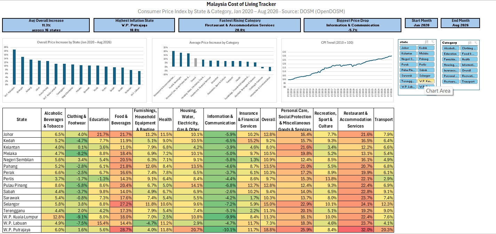
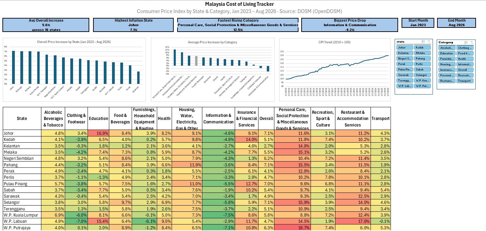

# 🇲🇾 Malaysia Cost of Living Tracker

An interactive Excel dashboard that tracks how consumer prices changed across Malaysia's 16 states and 13 spending categories, using official data from the Department of Statistics Malaysia (DOSM).

**Tools:** Excel (Power Query, Dynamic Arrays, XLOOKUP, PivotTables, Slicers, Conditional Formatting)



---

## 📌 1. Problem Statement

- Malaysian households have felt rising living costs since the pandemic, but the increase is not the same across every state or spending category.
- Policymakers, businesses, and households need a simple way to see *where* and *on what* prices rose the most.
- **Q1:** Which spending categories had the highest price increase from 2020 to the latest month?
- **Q2:** Which states experienced the highest overall inflation?
- **Q3:** Is inflation in each state driven by the same categories, or does it differ?
- **Q4:** How has the price trend changed month by month?

---

## 📂 2. Dataset

| Item | Detail |
|---|---|
| Source | [OpenDOSM – Monthly CPI by State & Division](https://open.dosm.gov.my/data-catalogue/cpi_state) |
| Lookup table | [OpenDOSM – MCOICOP classification](https://open.dosm.gov.my/data-catalogue/mcoicop) |
| Period | January 2010 – August 2026 (200 months) |
| Coverage | 16 states × 13 categories + Overall |
| Rows | 44,800 |
| Measure | Consumer Price Index (base year 2010 = 100) |
| License | CC BY 4.0 |

**Columns used:** `state`, `date`, `division` (category code), `index`

---

## 🛠️ 3. Tools & Skills Demonstrated

| Skill | Where it was used |
|---|---|
| Power Query | Importing CSVs, setting data types, merging the category lookup table |
| Dynamic array formulas | `SORT`, `UNIQUE`, `SORTBY`, `TRANSPOSE` to build auto-updating lists |
| Lookup & aggregation | `SUMIFS`, `XLOOKUP`, `COUNTIFS`, `RANK.EQ` |
| Data validation | Month dropdowns and an input error warning |
| PivotTables & slicers | Monthly trend chart filtered by state and category |
| Data visualisation | KPI cards, bar charts, line chart, heatmap |

---

## 🔄 4. Project Workflow

1. **Define the problem** – wrote business questions before touching the data
2. **Collect data** – downloaded CPI and category lookup files from OpenDOSM
3. **Clean & shape** – used Power Query to merge category codes with category names
4. **Calculate** – computed % price change for every state and category
5. **Visualise** – built charts, a heatmap and a PivotChart
6. **Build the dashboard** – combined everything into one interactive page
7. **Analyse** – wrote insights, recommendations and limitations

---

## 🧹 5. Data Cleaning & Validation

- **Row count check:** 200 months × 16 states × 14 categories = **44,800 rows**, which matched the file exactly (no missing months)
- **Missing values:** none found in the `index` column
- **Category codes:** kept as text so that codes like `01` did not lose their leading zero and still matched the lookup table
- **Lookup filter:** the MCOICOP table contains 4 levels of detail; only the 13 main divisions (2-digit level) were kept
- **"Overall" rows:** had no match in the lookup table, so they were labelled using a conditional column

---

## 🧮 6. Key Calculations

**Price change (%) between two months:**

```
% Change = (Index at End Month ÷ Index at Start Month) − 1
```

In Excel, this is calculated for every state and category with `SUMIFS`, using locked table references so the formula can be filled across the grid safely.

**Rankings:** `RANK.EQ` for states; `COUNTIFS` for categories so that the "Overall" benchmark is excluded from the ranking.

---

## 📊 7. Dashboard Features

- **Start and End Month dropdowns** – every KPI, chart, title and the heatmap updates automatically
- **Input warning** – appears if the end month is set before the start month
- **4 KPI cards** – average increase, highest-inflation state, fastest-rising category, biggest price drop
- **State ranking chart** – overall price increase by state
- **Category ranking chart** – with "Overall" highlighted in grey as a benchmark
- **Trend chart with slicers** – filter the monthly trend by state and category
- **Live heatmap** – red = largest increase, green = decrease



---

## 💡 8. Key Insights (Jan 2020 – Aug 2026)

**1. Eating out and daily essentials drove the cost of living**
- Restaurant & Accommodation Services rose the most (20.8% average), followed by Food & Beverages (18.4%) and Personal Care (17.7%)
- These are frequent, everyday purchases, so households feel them strongly

**2. Inflation was uneven across states**
- W.P. Putrajaya recorded the highest overall increase (18.8%), more than double W.P. Labuan (7.3%)
- Putrajaya also led in Restaurants (32.0%), Food (28.7%) and Transport (20.3%)

**3. Some categories got cheaper**
- Information & Communication prices fell in all 16 states (−5.7% average)
- Clothing & Footwear fell in 10 of 16 states (−2.0% average), with Kuala Lumpur seeing the largest drop (−9.1%)

**4. The story changes depending on the time period**
- Since January 2023, Johor has overtaken Putrajaya as the state with the highest inflation (7.1%)
- Between October 2014 and January 2020, Alcoholic Beverages & Tobacco rose far faster than any other category (38.8%)

**5. Prices dipped in 2020, then climbed faster**
- The trend shows a sharp drop around 2020, coinciding with the COVID-19 period, followed by a steeper rise from 2021 onwards

---

## ✅ 9. Recommendations

- **Policymakers:** cost-of-living support focused on food and eating out would target the largest price increases
- **F&B businesses:** price sensitivity is likely highest in states such as Putrajaya and Selangor, where restaurant prices rose the most
- **Further analysis:** investigate why Johor's inflation has accelerated since 2023

---

## ⚠️ 10. Limitations

- The "average across states" is a simple average, not DOSM's official weighted national figure
- CPI measures **price change**, not **price level**. A state with lower inflation may still be more expensive to live in
- This analysis shows *what* changed, not *why*. Explaining causes would require additional data sources

---

## 📁 11. Repository Structure

```
Malaysia_Cost_of_Living_Tracker/
├── Data/
│   └── Raw/                      # Original CSVs from OpenDOSM
├── Excel/
│   └── Malaysia_CPI_Tracker.xlsx # Dashboard workbook
├── Images/                       # Dashboard screenshots
└── README.md
```

---

## ▶️ 12. How to Use

1. Download `Excel/Malaysia_CPI_Tracker.xlsx`
2. Open the **Dashboard** sheet
3. Choose a **Start Month** and **End Month** from the dropdowns
4. Use the **state** and **Category** slicers to explore the trend chart (select one category at a time)
5. To update with newer data: replace the CSV in `Data/Raw/`, then go to **Data → Refresh All**

---

## 👤 Author

**Aqilah**
- GitHub: [aqilahothmannn](https://github.com/aqilahothmannn)
- LinkedIn: https://www.linkedin.com/in/aqilahothman00/
